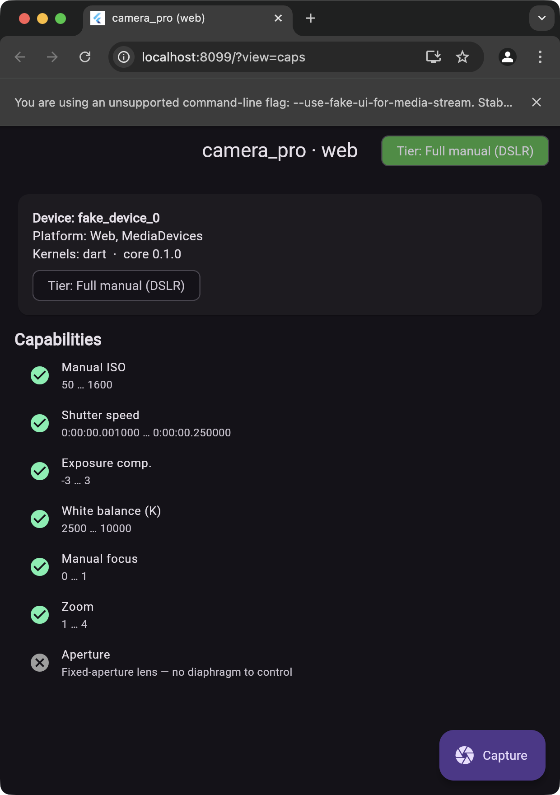
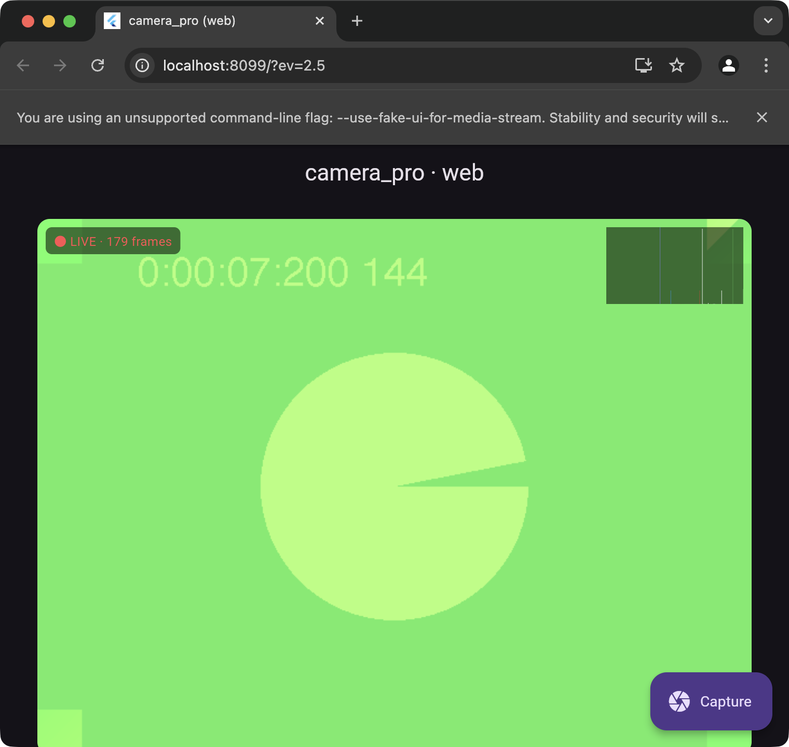
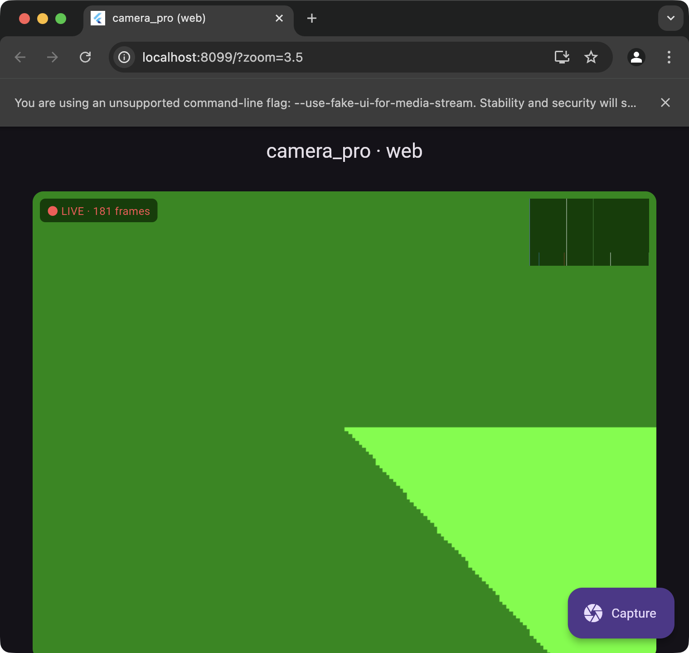
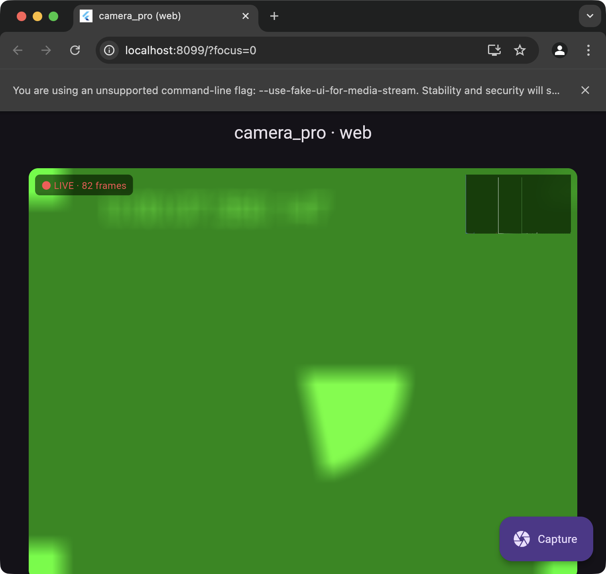
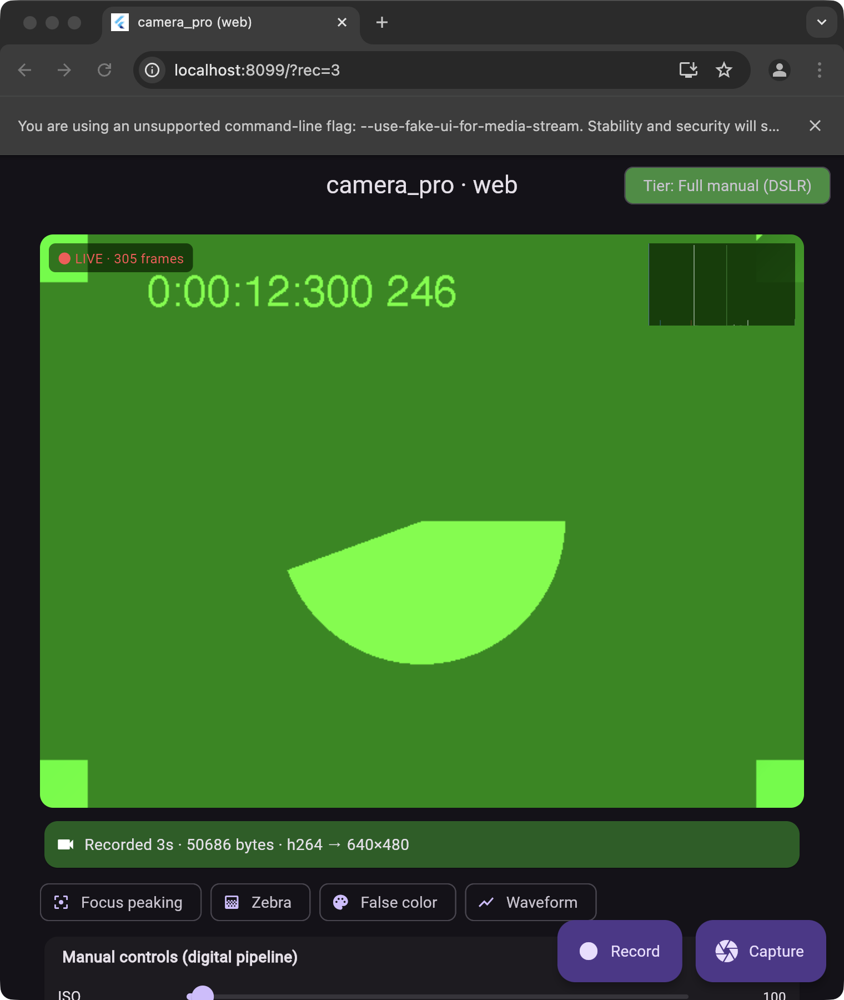
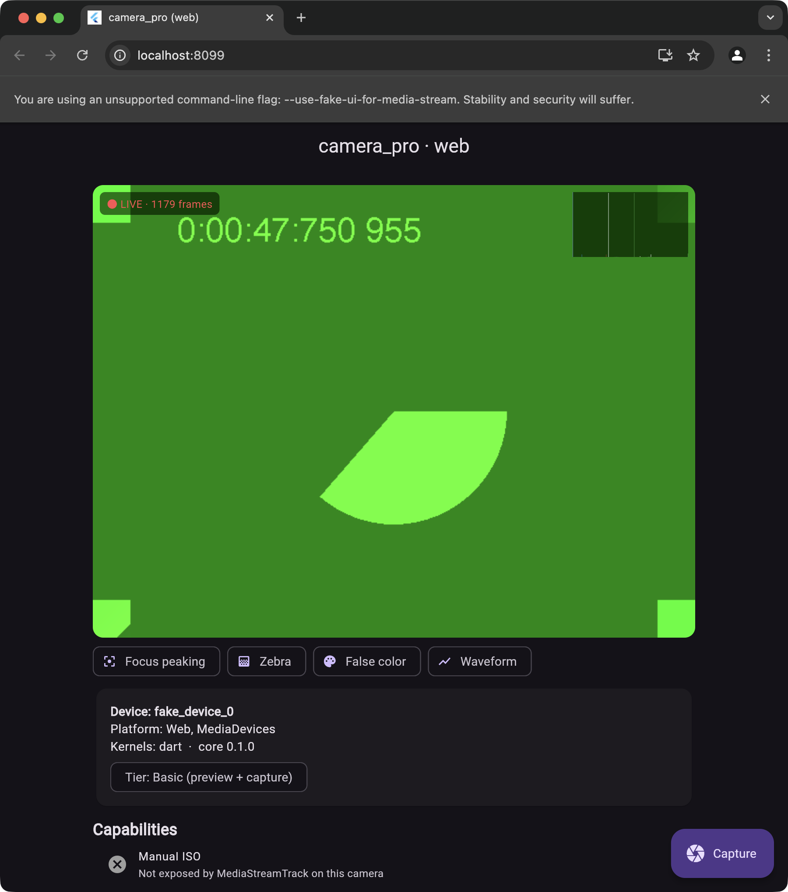
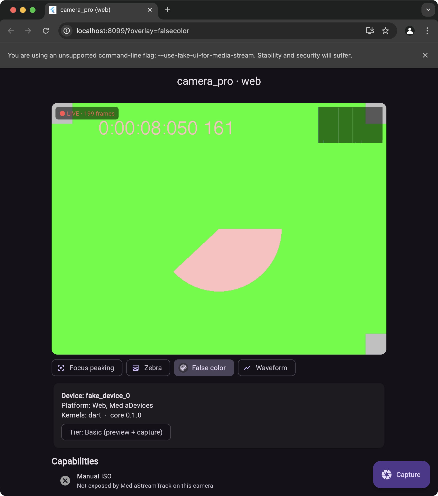
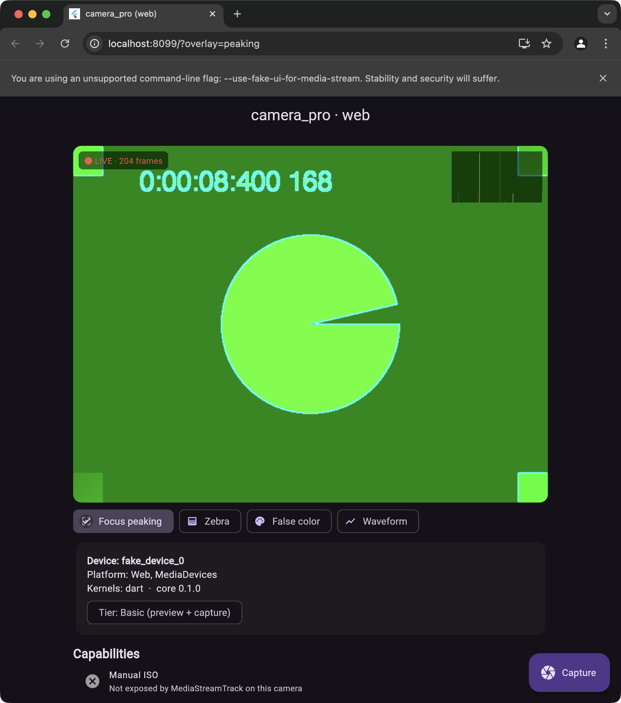
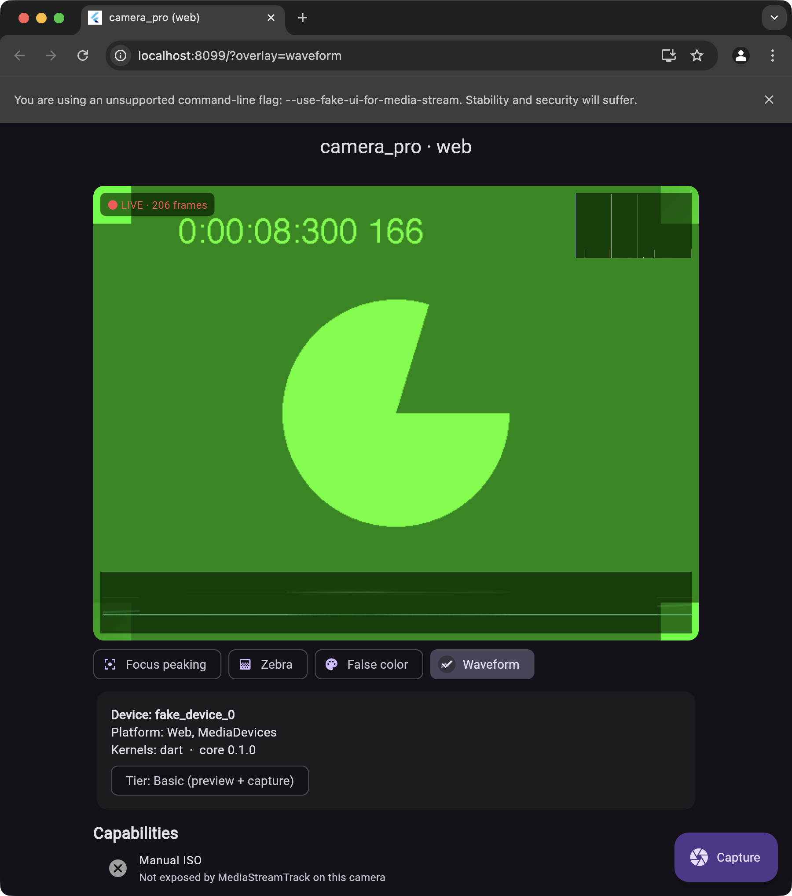
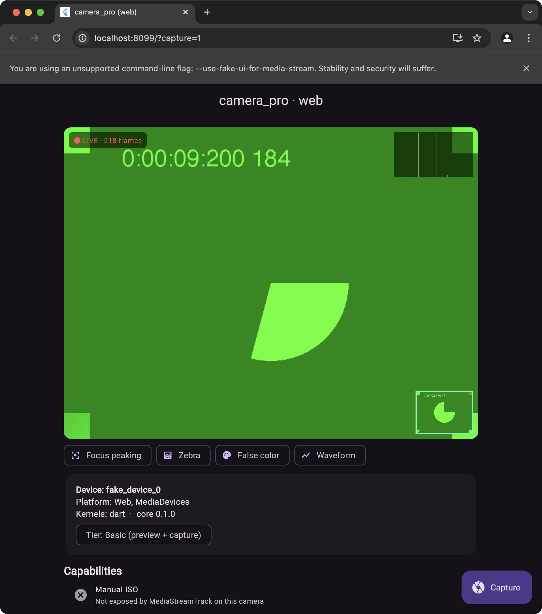

# camera_pro

[](https://pub.dev/packages/camera_pro)
[](LICENSE)
[](https://github.com/sayed3li97/camera_pro/actions/workflows/native.yml)

A Flutter camera package built on a shared C/C++ core with a crash-proof Dart API and a capability passport pattern — designed for production-quality camera UX across all platforms.

> Published on pub.dev: **[pub.dev/packages/camera_pro](https://pub.dev/packages/camera_pro)** · `flutter pub add camera_pro`

---

> **Project status: working camera engine (v0.0.2, pre-release)**
>
> On macOS the example app opens the real camera and does live preview, all six manual controls, five live visual-aid overlays (histogram, focus peaking, zebra, false color, waveform — GPU-accelerated via Metal where available), PNG + RAW/DNG capture with EXIF, burst, EV bracketing, and H.264 video recording — every one of those verified live against real hardware. The same AVFoundation backend compiles for iOS with sensor-level manual controls. **Web** runs in the browser too: a getUserMedia backend with live preview, capture, and the visual aids reimplemented in pure Dart — verified in Chrome with screenshots ([see below](#web)). Linux (V4L2) and Windows (Media Foundation) backends implement the full HAL contract and pass CI on real ubuntu/windows runners (camera-hardware runtime pending machines with cameras). Android is not started — see [ROADMAP.md](ROADMAP.md) for the honest gate on every remaining item.

---

## Why camera_pro?

Most Flutter camera packages wrap platform APIs directly and surface raw exceptions. `camera_pro` takes a different approach:

| Design choice | What it means for you |
|---|---|
| **Shared C core** | Image processing (histograms, YUV→RGBA conversion, focus peaking, zebra) runs the same bit-exact code on every platform, compiled with SIMD where available (NEON on arm64). |
| **HAL abstraction** | A C platform-abstraction layer (`camera_hal.h`) separates the core from each platform backend. Adding a new platform means implementing one HAL contract, not forking the whole package. |
| **Capability passport** | Every feature the camera reports is a `Capability<T>` — either `Supported<T>` (with current value, min, max, step) or `NotSupported<T>` (with a reason string). Your UI never crashes trying to set a feature the device doesn't have. |
| **Typed errors** | A sealed `CameraProError` hierarchy with a `CameraErrorRecovery` hint on every error. No raw platform exceptions bubble up unchecked. |
| **Dart FFI + native assets** | The C core is compiled automatically at build time via Flutter's native-assets hook. No manual `.so`/`.dylib` bundling. |
| **Tier system** | `CameraTier { full, standard, basic }` is derived from the capability passport. Your UI can adapt layout to what the hardware actually supports. |

---

## Architecture at a glance

A camera frame's path from the sensor, across the single Dart ↔ native FFI
boundary, up to the live overlay:



More animated diagrams — **capability passport → tier**, the **visual-aids
pipeline**, the **digital manual-control** trick, and the **web pure-Dart
split** — in **[doc/diagrams/](doc/diagrams/)**. (They animate on GitHub.)

---

## Feature status

Every feature below is a `Capability<T>` — `Supported` (with a range) or
`NotSupported` (with a reason). `determineTier` turns the whole passport into a
control tier:



### Architecture

| Feature | Status | Notes |
|---|---|---|
| Shared C core (camera_pro_core.h) | ✅ | Compiles on macOS arm64, Windows, Linux via native-assets |
| Lock-free buffer pool (C) | ✅ | 60-check C harness (also MSVC-compatible aligned alloc) |
| SIMD histogram kernels (NEON + SSSE3) | ✅ | Bit-exact vs scalar; x86 path verified under Rosetta and on CI |
| Scalar fallback histogram | ✅ | Active when NEON unavailable |
| YUV→RGBA format conversion (YUV420p, NV12, NV21) | ✅ | NEON fast path for 420P (bit-exact, 0.66ms/1080p); scalar elsewhere |
| native-assets FFI build hook | ✅ | hook/build.dart, verified end-to-end |
| Dart capability passport | ✅ | `Capability<T>`, `Supported<T>`, `NotSupported<T>` |
| Dart typed error hierarchy | ✅ | Sealed `CameraProError` + `CameraErrorRecovery` |
| Dart state machine | ✅ | `CameraState` + `stateChanges` stream |
| Tier selection (`determineTier`) | ✅ | Derived from capabilities |
| Conformant stub HAL backend | ✅ | All HAL contract methods implemented as no-ops |
| Android NDK Camera2 HAL | ❌ | Gated on Android hardware for honest verification |
| Apple AVFoundation HAL (iOS/macOS) | ✅ | Enumeration, capabilities, manual controls, live preview, photo/RAW capture, video recording |
| Windows Media Foundation HAL | ✅ CI | Full 44-fn contract; compiles + lifecycle harness runs on windows-latest |
| Linux V4L2 HAL | ✅ CI | Full contract incl. mmap streaming; compiles + runs on ubuntu-latest |
| Web (getUserMedia) HAL | ✅ | `WebCameraBackend` — MediaDevices preview, capture, capabilities; visual aids in pure Dart. Runs in the browser (screenshots below) |
| Flutter texture registration | 🚧 | API surface designed; not connected |

### Manual controls

Where a camera exposes no sensor controls (the macOS built-in camera, most
browsers), all six controls run through a digital pipeline — so the device
still reaches `CameraTier.full`:



| Feature | Status | Notes |
|---|---|---|
| ISO setter (`setIso`) | ✅ | Capability-guarded; throws `CameraFeatureNotSupportedError` if not supported |
| Shutter speed setter (`setShutterSpeed`) | ✅ | Capability-guarded |
| Exposure compensation setter (`setExposureCompensation`) | ✅ | Capability-guarded |
| White balance setter (`setWhiteBalance`) | ✅ | Preset and temperature modes |
| Focus distance setter (`setFocusDistance`) | ✅ | Capability-guarded |
| Zoom setter (`setZoom`) | ✅ | Capability-guarded |
| Flash mode setter (`setFlashMode`) | ✅ | Capability-guarded |
| Aperture control | 🚧 | Capability modelled; no hardware exposes it on mobile |
| Manual controls — iOS (sensor) | ✅ | Wired to `AVCaptureDevice`: custom exposure duration + ISO, lens position, WB gains, zoom, torch — compiled against the iOS SDK |
| Manual controls — macOS (digital) | ✅ | The built-in camera exposes **no** sensor controls (measured across AVFoundation, CoreMediaIO, and IOKit/USB — see note below), so ISO, shutter, exposure, white balance, focus, and zoom are applied by a **digital pipeline** in the C core (`camera_pro_adjust_pixels`, `camera_pro_digital_zoom`, `camera_pro_box_blur`). Verified changing the live feed. → `CameraTier.full` |
| Manual controls — web (digital) | ✅ | Browsers expose almost no sensor controls, so the same six controls run through the **pure-Dart** digital pipeline (`NativeCore.adjustPixels`/`digitalZoom`/`boxBlur`). Verified live in Chrome (exposure/zoom/focus visibly change the feed). → `CameraTier.full` |

### Visual aids

One preview frame is dispatched to the Metal GPU when available or the SIMD CPU
core otherwise — both produce byte-identical overlays:



| Feature | Status | Notes |
|---|---|---|
| Sobel focus peaking (C core) | ✅ | `camera_pro_compute_focus_peaking` |
| Zebra highlight clipping (C core) | ✅ | `camera_pro_compute_zebra` |
| RGBA histogram (C core) | ✅ | `camera_pro_compute_histogram_rgba` + `_scalar` |
| Live histogram overlay from camera frames | ✅ | Native compute per preview frame → painted overlay in the example |
| Live focus-peaking overlay (camera frames) | ✅ | Sobel C kernel per frame, toggleable cyan overlay; verified on the live feed |
| Live zebra over-exposure overlay (camera frames) | ✅ | C kernel per frame, toggleable |
| Live false-color exposure map (camera frames) | ✅ | C kernel per frame; verified rendering correct exposure zones |
| Live waveform monitor (camera frames) | ✅ | C kernel per frame; toggleable graph overlay |
| Luminance waveform monitor (C core) | ✅ | `camera_pro_compute_luma_waveform` → `WaveformData` |
| False-color exposure map (C core) | ✅ | `camera_pro_compute_false_color` |
| GPU compute (Metal): histogram/peaking/zebra | ✅ | Runtime-compiled MSL, bit-exact vs CPU on M1 Pro; auto GPU/CPU dispatch. Vulkan/D3D11/WebGPU ⛔ platform-gated |
| Live camera preview (macOS/iOS) | ✅ | AVFoundation frames → FFI → `dart:ui` (no TextureRegistry needed); verified streaming on real hardware |

### Capture

One frame, three encoders — PNG, a dependency-free linear-DNG writer (with
EXIF), and video:



Burst and exposure bracketing run through the same capture path:



| Feature | Status | Notes |
|---|---|---|
| `capturePhoto()` API surface | ✅ | Method exists, capability-guarded, typed error on failure |
| Photo capture to disk (macOS/iOS) | ✅ | Frame grab → PNG on disk (with manual adjustments applied); verified saving a 1920×1080 PNG |
| Full-res JPEG/HEIF capture (`AVCapturePhotoOutput`) | 🚧 | Frame-grab capture works today; full-res output is roadmap |
| RAW/DNG capture | ✅ | Dependency-free linear-DNG writer with EXIF; ffmpeg-verified from the real camera |
| EXIF embedding | ✅ | ISO, exposure time, timestamps in the DNG's EXIF IFD |
| libjpeg-turbo integration | — | Skipped by design (PNG via dart:ui + DNG cover stills) |
| Burst / EV bracket | ✅ | Verified: 5-shot burst ~1.2s; bracket YAVG 25.8/96.9/183.4. HDR fusion ❌ |

### Video

| Feature | Status | Notes |
|---|---|---|
| Video recording | ✅ | AVCaptureMovieFileOutput → .mov (h264), ffprobe-verified |
| Live streaming | 🚧 | API modelled (StreamConfig/StreamStatus); transport is roadmap |
| Frame processors | ✅ | FrameProcessor plugin API on the preview path, tested |
| `VideoResolution` / `Bitrate` value types | ✅ | Defined in Dart |
| `VideoCodec` / `StreamProtocol` enums | ✅ | Defined in Dart |

### Robustness

| Feature | Status | Notes |
|---|---|---|
| Sealed typed error hierarchy | ✅ | 9 error subclasses, each with `CameraErrorRecovery` |
| Thermal throttle signalling | ✅ | `ThermalLevel` / `ThermalPolicy` in Dart |
| Device quirks registry | ✅ | 8 community-sourced entries |
| Multi-camera support | ✅ | Concurrent two-device open verified on real cameras |
| Depth / LiDAR | 🚧 | Not started |

---

## Platform support

| Platform | Camera access | C core + stub | Notes |
|---|---|---|---|
| Android | 🚧 | ✅ | NDK Camera2 HAL designed, not wired |
| iOS | ✅ controls + preview | ✅ | AVFoundation HAL: enumeration, capabilities, manual controls, live preview (compiled vs iOS SDK) |
| macOS | ✅ preview + manual | ✅ | Live preview streaming on real cameras; full manual control set (ISO/shutter/exposure/WB/focus/zoom) via the digital pipeline since the built-in camera exposes no sensor controls → `CameraTier.full` |
| Windows | ✅ CI | ✅ | Media Foundation backend (full 44-fn contract) compiles + lifecycle harness runs on CI; camera runtime ⛔ needs hardware |
| Linux | ✅ CI | ✅ | V4L2 backend (full contract, mmap streaming) compiles + lifecycle harness runs on CI; camera runtime ⛔ needs hardware |
| Web | ✅ | ✅ (pure Dart) | getUserMedia backend, **full manual controls** + visual aids + RAW/DNG in pure Dart; reaches `CameraTier.full`. Builds and runs in the browser, browser tests pass in CI |

All platforms get the C core and stub backend today. Platform camera access requires the corresponding HAL implementation.

---

## Installation

`camera_pro` is not yet published to pub.dev. Add it as a path or git dependency:

```yaml
# pubspec.yaml

dependencies:
  camera_pro:
    git:
      url: https://github.com/sayed3li97/camera_pro.git
      ref: main   # or pin to a commit SHA for reproducibility
```

**Native assets requirement.** The C core is compiled automatically via Flutter's native-assets feature. This is enabled by default in Flutter 3.22 and later. No manual `.so`/`.dylib` bundling is needed.

Verify your Flutter version supports native assets:

```sh
flutter --version
# Flutter 3.22.0 or later required
```

---

## Quick start

The following snippet works today. You get a stub backend (no real camera frames), but the FFI call into the C core, the capability passport, the state machine, and typed errors are all live:

```dart
import 'package:camera_pro/camera_pro.dart';

Future<void> main() async {
  // nativeCoreVersion is a real FFI call into the compiled C core.
  print(CameraPro.nativeCoreVersion); // "0.0.2"
  print(CameraPro.simdKernel);        // "NEON" on arm64, "scalar" otherwise

  // create() returns a controller backed by the stub HAL until a platform HAL lands.
  final controller = await CameraPro.create();

  print(controller.tier);   // CameraTier.basic on stub

  // Capability passport: check before building UI.
  switch (controller.capabilities.iso) {
    case Supported<int>(:final currentValue, :final minValue, :final maxValue):
      print('ISO $currentValue  [$minValue – $maxValue]');
      // Show ISO slider.
    case NotSupported<int>(:final reason):
      print('ISO not supported: $reason');
      // Disable ISO control.
  }

  // Typed setters — never crash; throw CameraProError subtypes on misuse.
  try {
    await controller.setIso(const Iso(400));
  } on CameraFeatureNotSupportedError catch (e) {
    print('${e.feature}: ${e.message}  recovery: ${e.recovery}');
  } on CameraInvalidParameterError catch (e) {
    print('Bad value: ${e.message}');
  }

  // White balance: preset or Kelvin temperature.
  await controller.setWhiteBalance(WhiteBalance.preset(WhiteBalanceMode.daylight));
  await controller.setWhiteBalance(WhiteBalance.temperature(5500));

  // Listen to state transitions.
  controller.stateChanges.listen((state) => print('Camera state: $state'));

  await controller.dispose();
}
```

---

## Verified this build

`native.yml` runs on every push across macOS, Ubuntu, Windows, and web — every
✅ in this README is one of those runs:



The following results were produced on macOS arm64 with Flutter 3.44.1 / Dart 3.12.1:

| Test suite | Result |
|---|---|
| C core (`clang -std=c11 -O2 -Wall -Wextra -Werror`) | **60/60 checks pass** (arm64 NEON) |
| Same harness compiled x86_64, run under **Rosetta 2** | **60/60** — SSSE3 histogram bit-exact vs scalar |
| Dart unit + FFI tests (`flutter test`, VM) | **80/80 pass** |
| Dart tests **in the browser** (`flutter test --platform chrome`) | **65/65 pass** (unit + web kernels + digital pipeline + DNG, compiled to JS) |
| `flutter analyze` (package + example) | **No issues** |
| GitHub Actions CI (`native.yml`) | **Green**: macos-14, ubuntu (gcc `-Werror` V4L2 + `-mssse3` core), windows (MSVC /W4 Media Foundation), **web** (browser tests + web-app build) |
| Metal GPU cross-check (`metal_test.c`, Apple M1 Pro) | Histogram + zebra **bit-exact** vs C kernels; peaking within 0.005% |
| Live camera preview (example app, real Mac camera) | **Streaming** |
| Video recording (`.mov`) | **ffprobe-verified**: h264, 640×480, ~30fps, 34s, 14.7MB |
| RAW capture (linear-DNG + EXIF from the real camera) | **ffmpeg-decodes** the 1920×1080 6.2MB DNG; pixel round-trip exact on synthetic data |
| Burst capture | **5 PNGs in ~1.2s** from one click |
| EV bracket (−2/0/+2) | **Measured** mean luminance 25.8 / 96.9 / 183.4 |
| Multi-camera | Two backends opened **different physical cameras** concurrently |
| Web sample app in Chrome (getUserMedia) | **Full manual (DSLR) tier** — 1000+ frames, all six manual controls change the feed live, all visual aids, capture ([screenshots](#web)) |
| Web RAW capture (pure-Dart linear-DNG) | **ffmpeg-decodes** the Dart-encoded DNG (20 direntries, matches the C writer) |
| Web video recording (MediaRecorder) | **Recorded** a 3s h264 clip (50 KB, 640×480) in-browser and reported it back |
| dartdoc / `dart pub publish --dry-run` | **0 warnings** each |

## Web

A single conditional export keeps `dart:ffi`/`dart:io` off the web build; the
browser gets a pure-Dart `WebCameraBackend` with the C kernels ported to Dart:



The package compiles for the browser: a conditional-import split keeps `dart:ffi`
and `dart:io` off the web tree, `WebCameraBackend` drives the camera via
`navigator.mediaDevices.getUserMedia`, and the visual-aid kernels
(histogram / focus peaking / zebra / false color / waveform) are reimplemented
in pure Dart — the same algorithms as the C core, cross-checked to produce
identical output.

```bash
cd example
flutter run -d chrome -t lib/web_main.dart
```

**Full manual controls on web, too.** Browsers expose almost no sensor controls
through `MediaStreamTrack`, so — exactly like the macOS built-in camera —
`camera_pro` applies ISO, shutter, exposure, white balance, focus, and zoom as a
**digital pipeline** in pure Dart on every frame (`NativeCore.adjustPixels` /
`digitalZoom` / `boxBlur`, ports of the C kernels). Every control is therefore
`Supported` and a browser camera reaches **`CameraTier.full` — "Full manual
(DSLR)"** — the same tier as native. The one honest exception is aperture
(*NotSupported*: a fixed-aperture lens has no diaphragm). RAW capture is real
too: a pure-Dart linear-DNG encoder (port of `dng_writer.c`) that ffmpeg decodes.
**Video recording** works via `MediaRecorder` (real h264/webm capture, returned
as an object URL). Burst and EV bracketing run through the shared controller.

Verified live in Chrome against a synthetic camera device
(`--use-fake-device-for-media-stream`, which renders a spinning ball + timestamp):

| | |
|---|---|
| **Full manual (DSLR) tier** — every control `Supported`; aperture the one honest exception |  |
| **Exposure** `+2.5 EV` — feed brightens (digital pipeline) |  |
| **Zoom** `3.5×` — center crop-zoom |  |
| **Manual focus** `0.0` — digital defocus (box blur) |  |
| **Video recording** — real MediaRecorder capture (h264, in-browser) |  |
| **Live preview + histogram** — getUserMedia stream, live RGB/luma histogram overlay |  |
| **False color** — pure-Dart exposure-zone map |  |
| **Focus peaking** — pure-Dart Sobel edge highlight |  |
| **Waveform** — pure-Dart luma waveform monitor |  |
| **Capture** — `capturePhoto()` still held in memory (thumbnail, lower-right) |  |

The status card reports **Platform: Web, MediaDevices**, **Kernels: dart**, and
**Tier: Full manual (DSLR)** — the capability passport and manual-control pipeline
working exactly as on native.

## Measured performance

The histogram kernel runs on NEON, SSSE3, and scalar paths — all bit-exact,
with an honest surprise (clang's auto-vectorized scalar edges the hand-written
NEON on the M1):



Frames ride a lock-free, cache-aligned ring, so nothing per-frame hits the Dart
garbage collector on the hot path:



`src/tests/bench.c`, 1920×1080 RGBA, median of 31 runs, Apple M1 Pro, `-O2`:

| Kernel | ms/frame | fps |
|---|---:|---:|
| YUV420P → RGBA (NEON) | 0.66 | 1510 |
| Zebra | 2.0 | 502 |
| Digital zoom 2× | 2.1 | 472 |
| Histogram (scalar, auto-vectorized) | 2.3 | 437 |
| Waveform (256 cols) | 2.6 | 380 |
| Histogram (hand-written NEON) | 3.1 | 328 |
| Digital adjust (gain+EV+WB) | 6.9 | 145 |
| False color | 15.5 | 64 |
| Box blur r=6 | 20.9 | 48 |
| Focus peaking (Sobel, CPU) | 34.4 | 29 |

Honest notes: clang's auto-vectorized scalar histogram *beats* the hand-written
NEON version on M1 Pro (the scatter loop dominates) — both stay, both are
bit-exact. CPU focus peaking is the one kernel below 60fps at 1080p; that is
exactly why the GPU (Metal) path exists — the example uses it automatically.
| macOS manual controls (all six) applied to the live feed | **Verified** — ISO/exposure/WB visibly transform the feed; example reaches `Tier: Full manual (DSLR)` |
| macOS sensor-control availability (3-layer recon) | **Measured: none** — probed AVFoundation (0 controls), CoreMediaIO (`kCMIOExposureControlClassID` etc. exist but 0 control objects on-device), and IOKit/USB (0 UVC devices). Hence the digital pipeline. |

---

## Documentation

| Document | Contents |
|---|---|
| [ARCHITECTURE.md](ARCHITECTURE.md) | C core internals, HAL contract, buffer pool design, SIMD strategy |
| [PLATFORM_GUIDE.md](PLATFORM_GUIDE.md) | How to implement a new platform HAL |
| [COOKBOOK.md](COOKBOOK.md) | Recipes: histogram UI, focus peaking overlay, manual exposure |
| [ROADMAP.md](ROADMAP.md) | Prioritised list of 🚧 items and ❌ future work |
| [CONTRIBUTING.md](CONTRIBUTING.md) | Build instructions, test commands, PR guidelines |

---

## License

BSD 3-Clause. See [LICENSE](LICENSE).
